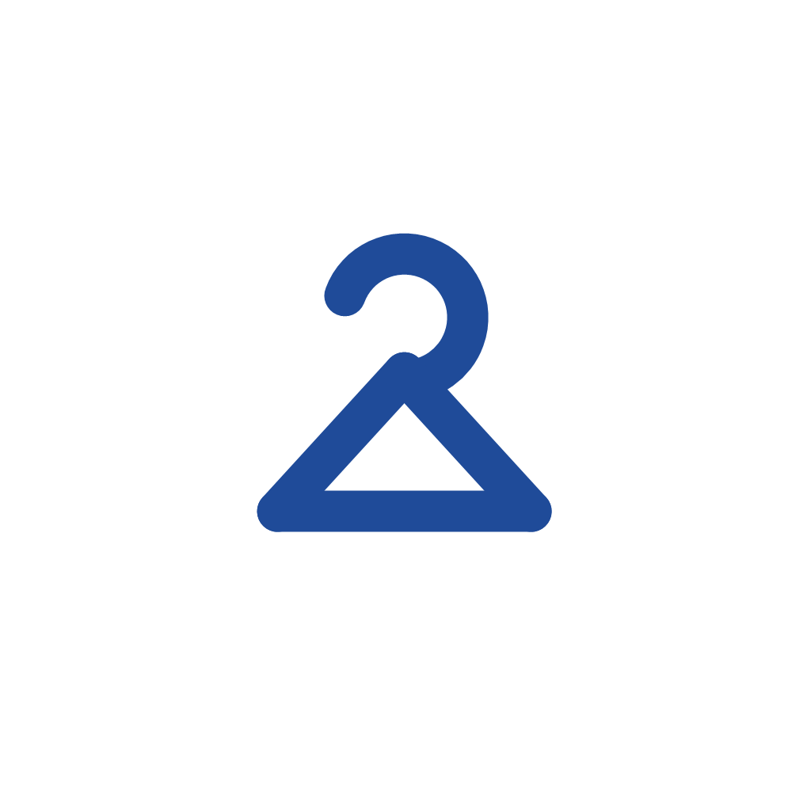

<div align="center">
  
  
  # Rentify
  
  ### 👗 Ứng dụng cho thuê trang phục trực tuyến đa chi nhánh
  
  [](https://flutter.dev)
  [](https://firebase.google.com)
  [](LICENSE)
  [](docs/TEST_SUMMARY.md)
  [](TESTING.md)
  
  [Tính năng](#-tính-năng) •
  [Demo](#-demo) •
  [Cài đặt](#-cài-đặt) •
  [Sử dụng](#-sử-dụng) •
  [Documentation](#-documentation) •
  [Team](#-team)
  
</div>

---

## 📖 Giới thiệu

**Rentify** là ứng dụng di động giúp người dùng tìm kiếm và thuê trang phục (áo dài, váy cưới, đầm dạ hội, vest...) từ nhiều chi nhánh, với tính năng **gợi ý chi nhánh gần nhất** dựa trên GPS.

> 🎓 **Dự án môn học**: Phát Triển Ứng Dụng Thiết Bị Di Động  
> 🏫 **Lớp**: 65CNTT - Trường Đại học Thủy Lợi  
> 👨‍🏫 **Giáo viên hướng dẫn**: TS. Đỗ Oanh Cường

---

## ✨ Tính năng

<table>
  <tr>
    <td>
      
### 🔐 Xác thực người dùng
- Đăng nhập/Đăng ký với Email & Password
- Đăng nhập nhanh với Google
- Xác thực sinh trắc học (Face ID/Fingerprint)
- Quản lý hồ sơ cá nhân

### 🏠 Duyệt & Tìm kiếm
- Danh sách sản phẩm theo danh mục
- Tìm kiếm theo tên, loại, size, giá
- Lọc và sắp xếp linh hoạt
- Xem chi tiết sản phẩm với nhiều ảnh

    </td>
    <td>

### 📍 GPS & Vị trí
- Tìm chi nhánh gần nhất
- Hiển thị khoảng cách
- Chỉ đường trên Google Maps
- Xem tồn kho theo chi nhánh

### 🛒 Giỏ hàng thông minh
- Thêm/xóa/cập nhật sản phẩm
- Quản lý nhiều chi nhánh
- Tính toán giá tự động
- Lưu giỏ hàng trên Cloud

    </td>
  </tr>
  <tr>
    <td>

### 🗓️ Đặt thuê
- Chọn ngày bắt đầu & kết thúc
- Tính tiền thuê theo ngày
- Quản lý tiền cọc
- Nhập địa chỉ giao hàng

### 📦 Quản lý đơn hàng
- Theo dõi trạng thái đơn hàng
- Lịch sử đơn thuê
- Thông báo cập nhật
- Hủy đơn hàng (nếu được)

    </td>
    <td>

### ⭐ Đánh giá & Yêu thích
- Đánh giá sản phẩm (1-5 sao)
- Viết nhận xét
- Đính kèm ảnh review
- Lưu sản phẩm yêu thích

### 🛠️ Admin Dashboard
- Quản lý chi nhánh
- Quản lý sản phẩm & tồn kho
- Quản lý đơn hàng
- Quản lý người dùng & đánh giá

    </td>
  </tr>
</table>

---

## 🎬 Demo

<!-- TODO: Add screenshots or video demo -->

<div align="center">
  
  
  
  
</div>

> 📸 **Note**: Screenshots sẽ được cập nhật sau khi hoàn thiện UI/UX

---

## 🚀 Tech Stack

<div align="center">

| Category | Technology |
|----------|-----------|
| **Frontend** |   |
| **Backend** |   |
| **Storage** |  |
| **Authentication** |   |
| **Maps & GPS** |  GeoFlutterFire |
| **State Management** |  |
| **Routing** |  |
| **Testing** |  Mockito |

</div>

---

## 📋 Prerequisites

Trước khi bắt đầu, đảm bảo bạn đã cài đặt:

- [Flutter](https://flutter.dev/docs/get-started/install) (>= 3.10.7)
- [Dart](https://dart.dev/get-dart) (>= 3.10.7)
- [Android Studio](https://developer.android.com/studio) hoặc [VS Code](https://code.visualstudio.com/)
- [Firebase CLI](https://firebase.google.com/docs/cli) (optional)
- Git

Kiểm tra cài đặt:
```bash
flutter doctor
```

---

## ⚙️ Cài đặt

### 1. Clone repository

```bash
git clone https://github.com/yourusername/rentify.git
cd rentify
```

### 2. Cài đặt dependencies

```bash
flutter pub get
```

### 3. Cấu hình Firebase

1. Tạo project trên [Firebase Console](https://console.firebase.google.com/)
2. Thêm ứng dụng Android/iOS
3. Tải file cấu hình:
   - Android: `google-services.json` → `android/app/`
   - iOS: `GoogleService-Info.plist` → `ios/Runner/`
4. Enable **Authentication**, **Firestore**, **Storage**

### 4. Cấu hình Supabase

1. Tạo project trên [Supabase](https://app.supabase.com/)
2. Tạo bucket cho storage: `products`, `reviews`
3. Cập nhật credentials trong code (nếu cần)

### 5. Chạy ứng dụng

```bash
# Development mode
flutter run

# Release mode
flutter run --release

# Chọn device cụ thể
flutter run -d <device-id>
```

---

## 🎯 Sử dụng

### Chạy trên emulator/simulator

```bash
# Android
flutter run

# iOS (chỉ trên macOS)
flutter run
```

### Build APK/IPA

```bash
# Android APK
flutter build apk --release

# Android App Bundle (Google Play)
flutter build appbundle --release

# iOS (chỉ trên macOS)
flutter build ios --release
```

---

## 📁 Cấu trúc Project

```
rentify/
├── android/                    # Android native code
├── ios/                        # iOS native code
├── lib/
│   ├── constants/             # App constants, colors, themes
│   ├── models/                # Data models
│   ├── providers/             # State management (Provider)
│   ├── screens/               # UI screens
│   │   ├── auth/             # Login, Register
│   │   ├── home/             # Home screen
│   │   ├── admin/            # Admin dashboard
│   │   └── ...
│   ├── services/              # Business logic & APIs
│   │   ├── auth_service.dart
│   │   ├── firebase_service.dart
│   │   └── supabase_service.dart
│   ├── viewmodels/            # ViewModels (MVVM)
│   ├── widgets/               # Reusable widgets
│   ├── utils/                 # Utilities
│   └── main.dart             # Entry point
├── test/                      # Test files
│   ├── unit/                 # Unit tests
│   ├── widget/               # Widget tests
│   └── integration/          # Integration tests
├── docs/                      # Documentation
│   ├── ARCHITECTURE.md
│   ├── API_DOCUMENTATION.md
│   ├── USER_MANUAL.md
│   └── DATABASE_DESIGN.md
├── assets/                    # Images, icons, fonts
├── pubspec.yaml              # Dependencies
└── README.md                 # This file
```

---

## 👥 Team

<table>
  <tr>
    <td align="center">
      <br />
      <sub><b>Lê Thị Như Quỳnh</b></sub><br />
      <sub>Team Lead</sub><br />
      <sub>2351060484</sub>
    </td>
    <td align="center">
      <br />
      <sub><b>Lê Thu Giang</b></sub><br />
      <sub>Developer</sub><br />
      <sub>2351060438</sub>
    </td>
    <td align="center">
      <br />
      <sub><b>Ngô Xuân Khánh</b></sub><br />
      <sub>Developer</sub><br />
      <sub>2351060453</sub>
    </td>
    <td align="center">
      <br />
      <sub><b>Trần Vĩnh Bảo</b></sub><br />
      <sub>Developer</sub>
    </td>
    <td align="center">
      <br />
      <sub><b>Nguyễn Quang Dũng</b></sub><br />
      <sub>Developer</sub>
      <sub>2251061749</sub>
    </td>
  </tr>
</table>

**Giáo viên hướng dẫn**: TS. Đỗ Oanh Cường

---

## 📄 License

Dự án này được cấp phép theo giấy phép MIT - xem file [LICENSE](LICENSE) để biết chi tiết.

---

## 📞 Contact

**Rentify Team**
- 📧 Email: contact@rentify.vn
- 🌐 Website: [www.rentify.vn](#)
- 💬 Issues: [GitHub Issues](https://github.com/yourusername/rentify/issues)

---

## 🙏 Acknowledgments

- [Flutter](https://flutter.dev/) - UI Framework
- [Firebase](https://firebase.google.com/) - Backend as a Service
- [Supabase](https://supabase.com/) - Storage solution
- [Material Design](https://material.io/) - Design guidelines
- Trường Đại học Thủy Lợi - Academic support

---

<div align="center">
  
  **⭐ Nếu bạn thấy project này hữu ích, hãy cho chúng tôi một star! ⭐**
  
  Made with ❤️ by Rentify Team
  
  © 2026 Rentify. All rights reserved.
  
</div>

## 🧪 Testing

Dự án có **59 tests** với coverage ~35%.

```bash
# Chạy tất cả tests
flutter test

# Chạy tests với coverage
flutter test --coverage

# Chạy specific test file
flutter test test/unit/models/product_model_test.dart

# Xem coverage report
genhtml coverage/lcov.info -o coverage/html
open coverage/html/index.html
```

**Test Statistics:**
- ✅ Unit Tests: 38 passing
  - Models: 38 tests
- ✅ Widget Tests: 21 passing
  - Common widgets: 21 tests

Xem chi tiết: [TESTING.md](TESTING.md) | [Test Summary](docs/TEST_SUMMARY.md)

---

## 📚 Documentation

Tài liệu chi tiết trong thư mục [`docs/`](docs/):

| Document | Description |
|----------|-------------|
| [📐 Architecture](docs/ARCHITECTURE.md) | Kiến trúc hệ thống, design patterns, data flow |
| [📖 API Documentation](docs/API_DOCUMENTATION.md) | Chi tiết API, services, models |
| [📱 User Manual](docs/USER_MANUAL.md) | Hướng dẫn sử dụng cho người dùng cuối |
| [🗄️ Database Design](docs/DATABASE_DESIGN.md) | Thiết kế Firestore schema |
| [🧪 Testing Guide](TESTING.md) | Hướng dẫn viết và chạy tests |

---

## 🤝 Contributing

Chúng tôi hoan nghênh mọi đóng góp! Vui lòng làm theo các bước sau:

1. Fork repository
2. Tạo branch mới (`git checkout -b feature/AmazingFeature`)
3. Commit changes (`git commit -m 'Add some AmazingFeature'`)
4. Push to branch (`git push origin feature/AmazingFeature`)
5. Mở Pull Request

### Code Style

- Tuân thủ [Effective Dart](https://dart.dev/guides/language/effective-dart)
- Chạy `flutter analyze` trước khi commit
- Viết tests cho features mới
- Update documentation khi cần

---
